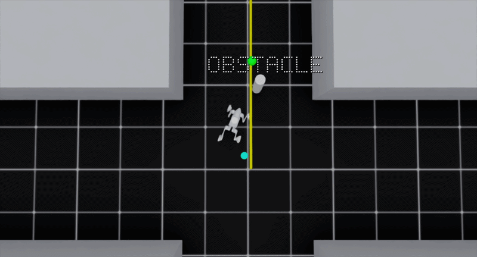
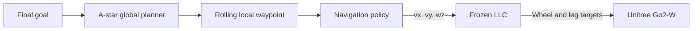

# Go2-W Hierarchical Navigation Baseline

This repository implements a hierarchical indoor navigation stack for the **Unitree Go2-W wheeled quadruped** using Isaac Lab and RSL-RL.



The stack separates the system into three modules:

1. an A* global planner generates a route and rolling local waypoint;
2. a high-level navigation controller (HLC) produces body-frame velocity commands; and
3. a frozen low-level locomotion controller (LLC) converts those commands into wheel and leg actions.

The repository includes locomotion training, privileged teacher training, depth-based student distillation, procedural HospitalMaze environments, policy playback, and evaluation utilities.


## System Architecture



| Module | Role | Output |
|---|---|---|
| A* global planner | Computes a route over the occupancy grid and selects a rolling local waypoint | Local navigation target |
| HLC navigation policy | Performs waypoint following and local obstacle avoidance | Body-frame command `[v_x, v_y, omega_z]` |
| Frozen LLC | Tracks the HLC command using robot proprioception | 4 wheel velocity targets and 12 leg position targets |

The HLC does not directly control individual joints. Navigation commands are executed through the frozen LLC.

## Navigation Policies

The navigation stack uses privileged teacher–student learning.

- **Teacher:** trained with PPO using privileged geometric and navigation observations.
- **Students:** trained by distillation using depth observations and robot-state inputs.
- **Student variants:** Baseline, LongHist, Sparse, and 4Cam.

The primary training environment is the procedural HospitalMaze environment. Earlier Flat and ObstacleFlat configurations are also retained in the repository.

## Repository Structure

| Path | Description |
|---|---|
| `source/go2w/` | Custom Isaac Lab extension for the Go2-W robot |
| `source/go2w/go2w/tasks/manager_based/go2w/` | Task registration, environments, configurations, and MDP terms |
| `scripts/rsl_rl/` | Training and policy playback scripts |
| `scripts/configs/` | Validation configuration |
| `scripts/slurm/` | HPC launch scripts |
| `source/isaaclab/` | Isaac Lab framework source included in this repository |
| `source/isaaclab_rl/` | Isaac Lab reinforcement-learning integration |
| `source/isaaclab_tasks/` | Isaac Lab task utilities |

## Installation

Follow the Isaac Lab installation procedure for the corresponding Isaac Sim environment.

From the repository root, install the custom Go2-W extension in editable mode:

```bash
./isaaclab.sh -p -m pip install -e source/go2w
```

The Go2-W package requires Python 3.10 or newer. The training scripts check for `rsl-rl-lib >= 3.0.1`.

List all registered Go2-W tasks:

```bash
./isaaclab.sh -p scripts/list_envs.py
```

Filter the task list:

```bash
./isaaclab.sh -p scripts/list_envs.py --keyword HospitalMaze
```

## Checkpoints

Project checkpoints are not included in the repository.

Define the required local checkpoint paths before running dependent stages:

```bash
export LLC_CKPT="/path/to/locomotion_checkpoint.pt"
export TEACHER_CKPT="/path/to/navigation_teacher_checkpoint.pt"
export STUDENT_CKPT="/path/to/depth_student_checkpoint.pt"
```

The dependency order is:

```text
LLC checkpoint
    └── Teacher training
          └── Student distillation

LLC checkpoint + navigation checkpoint
    └── Full-stack playback
```

## Training

Training uses:

```text
scripts/rsl_rl/train.py
```

Common options include:

```text
--task
--num_envs
--seed
--max_iterations
--run_name
--logger
--resume
--load_run
--checkpoint
```

### Train the LLC


```bash
./isaaclab.sh -p scripts/rsl_rl/train.py \
  --task Loco-FastFlat-Go2w-v0 \
  --num_envs 8192 \
  --headless
```

Adjust `--num_envs` to the available GPU memory.

### Train the HospitalMaze Teacher

The navigation teacher requires a pretrained LLC:

```bash
./isaaclab.sh -p scripts/rsl_rl/train.py \
  --task Nav-HospitalMaze-Teacher-Go2w-v0 \
  --num_envs 8192 \
  --locomotion_checkpoint "$LLC_CKPT" \
  --headless
```

### Distill the Baseline Depth Student

Student training requires both the teacher and LLC checkpoints:

```bash
./isaaclab.sh -p scripts/rsl_rl/train.py \
  --task Nav-HospitalMaze-Distill-Depth-Go2w-v0 \
  --num_envs 1024 \
  --teacher_checkpoint "$TEACHER_CKPT" \
  --locomotion_checkpoint "$LLC_CKPT" \
  --enable_cameras \
  --headless
```

Other student variants use the corresponding task ID:

| Variant | Training task |
|---|---|
| Baseline | `Nav-HospitalMaze-Distill-Depth-Go2w-v0` |
| LongHist | `Nav-HospitalMaze-Distill-Depth-LongHist-Go2w-v0` |
| Sparse | `Nav-HospitalMaze-Distill-Depth-Sparse-Go2w-v0` |
| 4Cam | `Nav-HospitalMaze-Distill-Depth-4Cam-Go2w-v0` |


## Playback

Two playback scripts are provided:

| Script | Purpose |
|---|---|
| `scripts/rsl_rl/play_cmd.py` | Run a locomotion policy with fixed or randomly sampled velocity commands |
| `scripts/rsl_rl/play.py` | Run navigation teachers, students, structured scenes, and evaluation tasks |

### Play the LLC with a Fixed Command

Forward motion:

```bash
./isaaclab.sh -p scripts/rsl_rl/play_cmd.py \
  --task Loco-FastFlat-Go2w-Play-v0 \
  --checkpoint "$LLC_CKPT" \
  --cmd_vx 1.0
```

Lateral motion:

```bash
./isaaclab.sh -p scripts/rsl_rl/play_cmd.py \
  --task Loco-FastFlat-Go2w-Play-v0 \
  --checkpoint "$LLC_CKPT" \
  --cmd_vy 0.5
```

Rotation in place:

```bash
./isaaclab.sh -p scripts/rsl_rl/play_cmd.py \
  --task Loco-FastFlat-Go2w-Play-v0 \
  --checkpoint "$LLC_CKPT" \
  --cmd_wz 1.0
```

Combined command:

```bash
./isaaclab.sh -p scripts/rsl_rl/play_cmd.py \
  --task Loco-FastFlat-Go2w-Play-v0 \
  --checkpoint "$LLC_CKPT" \
  --cmd_vx 1.0 \
  --cmd_vy 0.3 \
  --cmd_wz 0.5
```

Use the task's native random command sampler:

```bash
./isaaclab.sh -p scripts/rsl_rl/play_cmd.py \
  --task Loco-FastFlat-Go2w-Play-v0 \
  --checkpoint "$LLC_CKPT" \
  --random_commands
```

Main LLC playback options:

| Option | Description |
|---|---|
| `--cmd_vx` | Forward velocity command in m/s |
| `--cmd_vy` | Lateral velocity command in m/s |
| `--cmd_wz` | Yaw-rate command in rad/s |
| `--random_commands` | Use the task's native random command sampler |
| `--num_envs` | Number of parallel environments |
| `--seed` | Environment seed |
| `--real-time` | Attempt real-time playback |

Show all options:

```bash
./isaaclab.sh -p scripts/rsl_rl/play_cmd.py --help
```

### Play the HospitalMaze Teacher

```bash
./isaaclab.sh -p scripts/rsl_rl/play.py \
  --task Nav-HospitalMaze-Teacher-Go2w-Play-v0 \
  --checkpoint "$TEACHER_CKPT" \
  --locomotion_checkpoint "$LLC_CKPT"
```

### Play a Depth Student

The following example runs the Baseline student in the static HospitalMaze evaluation environment:

```bash
./isaaclab.sh -p scripts/rsl_rl/play.py \
  --task Nav-HospitalMaze-Distill-Depth-Eval-Static-Go2w-v0 \
  --checkpoint "$STUDENT_CKPT" \
  --locomotion_checkpoint "$LLC_CKPT" \
  --enable_cameras
```

Add `--headless` for playback without the graphical viewport.

The navigation playback script also supports options for:

- static and moving obstacles;
- fixed scenario layouts;
- structured corridors;
- A* lookahead and clearance parameters;
- navigation logging;
- viewport video;
- depth-camera video; and
- finite-episode evaluation.

See [`scripts/README.md`](scripts/README.md) for the complete command reference.

## Evaluation Utilities

The multi-policy validation entry point is:

```text
scripts/run_validation.py
```

Its default configuration is:

```text
scripts/configs/validation.yaml
```

Update the checkpoint paths in the YAML file before running:

```bash
./isaaclab.sh -p scripts/run_validation.py \
  --out_name validation_run
```

Evaluation results are not distributed as part of this repository documentation.

## Documentation

Detailed documentation is organized by component:

- [`scripts/README.md`](scripts/README.md)
  Training, playback, fixed-command control, validation, logging, video, and cluster usage.

- [`source/go2w/README.md`](source/go2w/README.md)
  Go2-W extension structure and registered task catalog.

- [`source/go2w/go2w/tasks/manager_based/go2w/cfg/locomotion/README.md`](source/go2w/go2w/tasks/manager_based/go2w/cfg/locomotion/README.md)
  LLC observations, actions, training configuration, and command playback.

- [`source/go2w/go2w/tasks/manager_based/go2w/cfg/navigation/README.md`](source/go2w/go2w/tasks/manager_based/go2w/cfg/navigation/README.md)
  Teacher–student navigation, HospitalMaze environments, depth variants, and global planning.

- [`scripts/slurm/README.md`](scripts/slurm/README.md)
  HPC training and validation launch scripts.

## Scope

This repository provides the simulation training and evaluation stack.

Physical-robot integration, real-sensor calibration, onboard deployment, and real-world validation are outside the current repository scope.

## Acknowledgements

This project uses:

- [Isaac Lab](https://github.com/isaac-sim/IsaacLab)
- [RSL-RL](https://github.com/leggedrobotics/rsl_rl)

for simulation and reinforcement-learning training of the Unitree Go2-W platform.