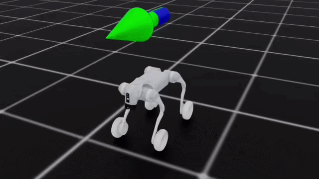

# Go2-W Locomotion Configuration

This directory contains the low-level locomotion controller configurations for the **Unitree Go2-W wheeled quadruped**.

The locomotion policy tracks planar body-velocity commands and produces hybrid wheel and leg actions. The trained FastFlat policy is also used as the frozen low-level controller in the hierarchical navigation stack.



## Overview

The low-level controller receives the command

```text
[v_x, v_y, omega_z]
```

where:

| Component | Unit | Description |
|---|---:|---|
| `v_x` | m/s | Body-frame longitudinal velocity |
| `v_y` | m/s | Body-frame lateral velocity |
| `omega_z` | rad/s | Yaw angular velocity |

The policy produces a 16-dimensional hybrid action:

```text
4 wheel velocity targets
+ 4 hip position targets
+ 8 thigh/calf position targets
= 16 actions
```

## Primary Tasks

| Task | Purpose |
|---|---|
| `Loco-FastFlat-Go2w-v0` | Train the FastFlat locomotion controller |
| `Loco-FastFlat-Go2w-Play-v0` | Play the FastFlat controller |
| `Loco-Flat-Go2w-v0` | Earlier flat-terrain locomotion configuration |
| `Loco-Flat-Go2w-Play-v0` | Playback configuration for the earlier flat task |

The primary LLC used by the hierarchical navigation stack is trained with:

```text
Loco-FastFlat-Go2w-v0
```

## Control Interface

### Observation

The FastFlat policy observation has 60 dimensions.

| Slice | Dimension | Description |
|---|---:|---|
| Base linear velocity | 3 | Linear velocity in the robot base frame |
| Base angular velocity | 3 | Angular velocity in the robot base frame |
| Projected gravity | 3 | Gravity direction expressed in the base frame |
| Velocity command | 3 | `[v_x, v_y, omega_z]` |
| Relative joint positions | 16 | Joint positions relative to the default configuration |
| Joint velocities | 16 | Joint angular velocities |
| Previous action | 16 | Previous raw policy action |
| **Total** | **60** | |

Observation order:

```text
[0:3]   base linear velocity
[3:6]   base angular velocity
[6:9]   projected gravity
[9:12]  velocity command
[12:28] relative joint positions
[28:44] joint velocities
[44:60] previous action
```

Observation corruption is enabled during training and disabled in the playback configuration.

### Action

The FastFlat action space is divided into three action terms.

| Action group | Dimension | Control mode | Scale |
|---|---:|---|---:|
| Wheels | 4 | Joint velocity target | `28.0` |
| Hips | 4 | Joint position target relative to the default pose | `0.35` |
| Thighs and calves | 8 | Joint position target relative to the default pose | `0.35` |
| **Total** | **16** | | |

The action ordering used by the frozen LLC interface is:

```text
[0:4]   wheel actions
[4:8]   hip actions
[8:16]  thigh and calf actions
```

## Simulation Rate

| Parameter | Value |
|---|---:|
| Physics time step | `0.005 s` |
| Physics frequency | `200 Hz` |
| Control decimation | `4` |
| Policy period | `0.020 s` |
| Policy frequency | `50 Hz` |
| Episode duration | `20 s` |

## Velocity Commands

The environment directly commands planar velocity rather than converting a heading target into a yaw-rate command.

The command sampler uses:

```text
heading_command = False
```

Commands are resampled every:

```text
4–8 s
```

A fraction of the training environments receives a zero-velocity command to train stationary behavior.

### FastFlat Curriculum

FastFlat training begins with reduced lateral and angular command ranges.

Initial ranges:

```text
v_x:     [-1.0, 1.0] m/s
v_y:     [-0.3, 0.3] m/s
omega_z: [-0.3, 0.3] rad/s
```

The curriculum expands the ranges over 600 training iterations to:

```text
v_x:     [-2.0, 2.0] m/s
v_y:     [-2.0, 2.0] m/s
omega_z: [-2.0, 2.0] rad/s
```

The FastFlat playback environment uses the final command ranges and disables the training curriculum.

## Training Configuration

The FastFlat RSL-RL runner uses:

| Parameter | Value |
|---|---:|
| Algorithm | PPO |
| Default environments | `8192` |
| Steps per environment | `128` |
| Maximum iterations | `2000` |
| Checkpoint interval | `100` iterations |
| Actor hidden layers | `[512, 256, 128]` |
| Critic hidden layers | `[512, 256, 128]` |
| Activation | ELU |
| Initial action noise standard deviation | `0.30` |
| Discount factor | `0.99` |
| GAE parameter | `0.95` |

The environment count can be overridden according to the available GPU memory.

## Training

Run the command from the repository root.

```bash
./isaaclab.sh -p scripts/rsl_rl/train.py \
  --task Loco-FastFlat-Go2w-v0 \
  --num_envs 8192 \
  --headless
```

Use fewer environments on a smaller GPU:

```bash
./isaaclab.sh -p scripts/rsl_rl/train.py \
  --task Loco-FastFlat-Go2w-v0 \
  --num_envs 2048 \
  --headless
```

Specify a seed and run name:

```bash
./isaaclab.sh -p scripts/rsl_rl/train.py \
  --task Loco-FastFlat-Go2w-v0 \
  --num_envs 8192 \
  --seed 42 \
  --run_name fastflat_seed42 \
  --headless
```

Override the configured number of iterations:

```bash
./isaaclab.sh -p scripts/rsl_rl/train.py \
  --task Loco-FastFlat-Go2w-v0 \
  --num_envs 8192 \
  --max_iterations 2000 \
  --headless
```

Show all training options:

```bash
./isaaclab.sh -p scripts/rsl_rl/train.py --help
```

## Checkpoints

Checkpoints are written under the RSL-RL log directory configured by the runner.

The default FastFlat experiment name is:

```text
go2w_fast_flat
```

A typical checkpoint path has the form:

```text
logs/rsl_rl/go2w_fast_flat/<RUN_DIRECTORY>/model_<ITERATION>.pt
```

Checkpoints are not included in the repository. Define a local path before playback:

```bash
export LLC_CKPT="/path/to/locomotion_checkpoint.pt"
```

## Playback with Fixed Commands

Use:

```text
scripts/rsl_rl/play_cmd.py
```

General form:

```bash
./isaaclab.sh -p scripts/rsl_rl/play_cmd.py \
  --task Loco-FastFlat-Go2w-Play-v0 \
  --checkpoint "$LLC_CKPT" \
  [command options]
```

### Stand Still

The fixed commands default to zero.

```bash
./isaaclab.sh -p scripts/rsl_rl/play_cmd.py \
  --task Loco-FastFlat-Go2w-Play-v0 \
  --checkpoint "$LLC_CKPT"
```

### Forward Motion

```bash
./isaaclab.sh -p scripts/rsl_rl/play_cmd.py \
  --task Loco-FastFlat-Go2w-Play-v0 \
  --checkpoint "$LLC_CKPT" \
  --cmd_vx 1.0
```

### Backward Motion

```bash
./isaaclab.sh -p scripts/rsl_rl/play_cmd.py \
  --task Loco-FastFlat-Go2w-Play-v0 \
  --checkpoint "$LLC_CKPT" \
  --cmd_vx -0.5
```

### Lateral Motion

```bash
./isaaclab.sh -p scripts/rsl_rl/play_cmd.py \
  --task Loco-FastFlat-Go2w-Play-v0 \
  --checkpoint "$LLC_CKPT" \
  --cmd_vy 0.5
```

### Rotation in Place

```bash
./isaaclab.sh -p scripts/rsl_rl/play_cmd.py \
  --task Loco-FastFlat-Go2w-Play-v0 \
  --checkpoint "$LLC_CKPT" \
  --cmd_wz 1.0
```

`--cmd_yaw` is accepted as an alias for `--cmd_wz`.

### Combined Motion

```bash
./isaaclab.sh -p scripts/rsl_rl/play_cmd.py \
  --task Loco-FastFlat-Go2w-Play-v0 \
  --checkpoint "$LLC_CKPT" \
  --cmd_vx 1.0 \
  --cmd_vy 0.3 \
  --cmd_wz 0.5
```

### Random Commands

Retain the environment's native command sampler:

```bash
./isaaclab.sh -p scripts/rsl_rl/play_cmd.py \
  --task Loco-FastFlat-Go2w-Play-v0 \
  --checkpoint "$LLC_CKPT" \
  --random_commands
```

### Multiple Environments

```bash
./isaaclab.sh -p scripts/rsl_rl/play_cmd.py \
  --task Loco-FastFlat-Go2w-Play-v0 \
  --checkpoint "$LLC_CKPT" \
  --cmd_vx 1.0 \
  --num_envs 16
```

### Real-Time Playback

```bash
./isaaclab.sh -p scripts/rsl_rl/play_cmd.py \
  --task Loco-FastFlat-Go2w-Play-v0 \
  --checkpoint "$LLC_CKPT" \
  --cmd_vx 0.5 \
  --real-time
```

### Playback Options

| Option | Description |
|---|---|
| `--checkpoint` | Path to the trained LLC checkpoint |
| `--cmd_vx` | Fixed longitudinal command in m/s |
| `--cmd_vy` | Fixed lateral command in m/s |
| `--cmd_wz` | Fixed yaw-rate command in rad/s |
| `--cmd_yaw` | Alias for `--cmd_wz` |
| `--random_commands` | Use the environment's native random command sampler |
| `--num_envs` | Number of parallel playback environments |
| `--seed` | Environment seed |
| `--real-time` | Attempt playback at the simulated control rate |
| `--disable_fabric` | Use USD operations instead of Fabric |

Show all options:

```bash
./isaaclab.sh -p scripts/rsl_rl/play_cmd.py --help
```

## Training Randomization

The training environment includes:

- rigid-body friction randomization;
- base-mass randomization;
- randomized initial base pose and velocity;
- randomized joint initialization;
- periodic external velocity disturbances;
- noisy proprioceptive observations; and
- command-range curriculum.

The FastFlat playback configuration disables:

- observation corruption;
- periodic pushes;
- base-mass randomization; and
- the speed curriculum.

## Reward Structure

The FastFlat reward configuration includes terms for:

- planar linear-velocity tracking;
- yaw-rate tracking;
- upright orientation;
- vertical-motion suppression;
- roll and pitch angular-velocity suppression;
- nominal base height;
- reduced leg-joint torque;
- nominal leg posture;
- straight-driving hip alignment;
- stationary posture;
- wheel-ground contact;
- zero-command wheel stabilization;
- action smoothness;
- undesired thigh and calf contact; and
- termination penalties.

Exact reward weights are defined in:

```text
env.py
```

## Termination Conditions

Episodes terminate when:

- the configured time limit is reached;
- the robot base contacts the ground; or
- the robot base height falls below the configured minimum.

## Frozen LLC Integration

The trained FastFlat policy is reused by navigation tasks through:

```text
FrozenLLCActionTerm
```

Implementation:

```text
source/go2w/go2w/tasks/manager_based/go2w/mdp/navigation/actions.py
```

During navigation, the action term:

1. receives the HLC command `[v_x, v_y, omega_z]`;
2. clamps the command to the LLC command range;
3. reconstructs the 60-dimensional LLC observation;
4. runs the frozen FastFlat actor;
5. applies four wheel velocity targets; and
6. applies twelve leg position targets.

Navigation training and playback therefore require a compatible LLC checkpoint:

```bash
--locomotion_checkpoint /path/to/locomotion_checkpoint.pt
```

The checkpoint must match the FastFlat observation layout, action ordering, and network architecture.

## Source Files

| File | Purpose |
|---|---|
| `env.py` | Scene, commands, observations, actions, rewards, events, and terminations |
| `../../observation_layout.py` | Shared 60D LLC observation slices |
| `../../agents/rsl_rl_ppo_cfg.py` | PPO runner and actor–critic configuration |
| `../../../mdp/locomotion/` | Custom locomotion reward and curriculum implementations |
| `../../../mdp/navigation/actions.py` | Frozen LLC integration used by navigation |

## Related Documentation

- [Project overview](../../../../../../../../README.md)
- [Scripts and command-line usage](../../../../../../../../scripts/README.md)
- [Go2-W extension overview](../../../../../../README.md)
- [Navigation configuration](../navigation/README.md)