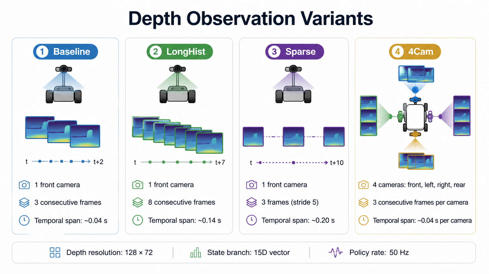

# Go2-W Navigation Configuration

This directory contains the high-level navigation configurations for the **Unitree Go2-W wheeled quadruped**.

The navigation policy follows a rolling local waypoint, avoids nearby obstacles, and outputs a planar velocity command:

```text
[v_x, v_y, omega_z]
```

The command is executed by a frozen low-level locomotion controller rather than being applied obstacles, and outputs a planar velocity command:

```text
[v_x, v_y, omega_z]
```

The command is executed by a frozen low-level directly to the robot joints.



## System Interface


| Component | Input | Output |
|---|---|---|
| A-star planner | Occupancy representation, start pose, and final goal | Global route |
| Waypoint update | Global route and current robot pose | Local navigation target |
| Navigation policy | Teacher or student observations | `[v_x, v_y, omega_z]` |
| Frozen LLC | HLC command and robot proprioception | 4 wheel velocity targets and 12 leg position targets |

## Main Training Tasks

| Policy | Task ID |
|---|---|
| Privileged teacher | `Nav-HospitalMaze-Teacher-Go2w-v0` |
| Baseline depth student | `Nav-HospitalMaze-Distill-Depth-Go2w-v0` |
| LongHist depth student | `Nav-HospitalMaze-Distill-Depth-LongHist-Go2w-v0` |
| Sparse depth student | `Nav-HospitalMaze-Distill-Depth-Sparse-Go2w-v0` |
| 4Cam depth student | `Nav-HospitalMaze-Distill-Depth-4Cam-Go2w-v0` |

List the complete task registry from the repository root:

```bash
./isaaclab.sh -p scripts/list_envs.py --keyword HospitalMaze
```

## Training Sequence

The navigation stack is trained in the following order:

```text
1. Train the FastFlat LLC
2. Freeze the LLC
3. Train the privileged navigation teacher
4. Freeze the teacher
5. Distill one or more depth students
```

Checkpoint dependencies:

```text
LLC checkpoint
    └── Teacher training

LLC checkpoint + teacher checkpoint
    └── Student distillation

LLC checkpoint + navigation checkpoint
    └── Navigation playback
```

Checkpoints are not included in the repository.

Example local variables:

```bash
export LLC_CKPT="/path/to/locomotion_checkpoint.pt"
export TEACHER_CKPT="/path/to/navigation_teacher_checkpoint.pt"
export STUDENT_CKPT="/path/to/depth_student_checkpoint.pt"
```

## HospitalMaze Environment

The primary navigation environment is a procedurally generated hospital-style maze.

The training scene contains:

- a `5 x 5` junction grid;
- corridor networks generated inside `48 x 48 m` terrain tiles;
- randomized corridor widths;
- static corridor geometry;
- physical obstacle and actor slots;
- an A-star route between sampled start and goal locations; and
- a rolling local waypoint derived from the route.

The HospitalMaze terrain implementation is located under:

```text
../../mdp/navigation/hospital/
```

The global planning implementation is located under:

```text
../../mdp/navigation/global_planning/
```

## Global Planning and Waypoints

The global planner computes an A-star route over the environment representation.

During execution, the route is converted into a local waypoint for the navigation policy. The waypoint is updated as the robot progresses along the route.

The HospitalMaze training configuration enables adaptive lookahead based on upcoming path curvature.

| Parameter | Value |
|---|---:|
| Nominal lookahead distance | `1.25 m` |
| Minimum adaptive lookahead | `0.55 m` |
| Curvature scan horizon | `2.5 m` |
| Curvature threshold | `0.3 rad` |

Relevant implementations:

```text
../../mdp/navigation/global_planning/
../../mdp/navigation/reset/
../../mdp/navigation/hospital/
```

The navigation policy receives the local waypoint through its goal-command observation. It does not receive the full global route directly.

## Navigation Action

The navigation policy outputs:

```text
[v_x, v_y, omega_z]
```

| Action | Unit | Meaning |
|---|---:|---|
| `v_x` | m/s | Body-frame longitudinal velocity |
| `v_y` | m/s | Body-frame lateral velocity |
| `omega_z` | rad/s | Yaw angular velocity |

The command is processed by:

```text
FrozenLLCActionTerm
```

Implementation:

```text
../../mdp/navigation/actions.py
```

The action term:

1. receives the three-dimensional navigation command;
2. clamps the command to the LLC command range;
3. reconstructs the 60-dimensional LLC observation;
4. evaluates the frozen locomotion actor; and
5. applies the resulting wheel and leg targets.

A compatible LLC checkpoint must be supplied for navigation training and playback:

```bash
--locomotion_checkpoint /path/to/locomotion_checkpoint.pt
```

## Privileged Teacher

The HospitalMaze teacher is trained with PPO.

Training task:

```text
Nav-HospitalMaze-Teacher-Go2w-v0
```

The teacher receives privileged geometric, path, and corridor information available in simulation.

### Teacher Observation

The HospitalMaze teacher observation has 393 dimensions.

| Observation group | Dimension |
|---|---:|
| Base velocity, projected gravity, and local goal | 9 |
| Three-channel 360-degree ray scan | 216 |
| Obstacle navigation features | 16 |
| Privileged geometry for eight nearby actor slots | 128 |
| Hospital path features | 10 |
| Hospital corridor features | 8 |
| Previous two HLC actions | 6 |
| **Total** | **393** |

The observation configuration is:

```text
NavHospitalTeacherObsCfg
```

The teacher outputs the same three-dimensional velocity command used by the students.

### Teacher PPO Configuration

| Parameter | Value |
|---|---:|
| Algorithm | PPO |
| Default environments | `8192` |
| Steps per environment | `96` |
| Maximum iterations | `1300` |
| Checkpoint interval | `100` iterations |
| Actor hidden layers | `[512, 256, 128]` |
| Critic hidden layers | `[512, 256, 128]` |
| Activation | ELU |

### Train the Teacher

Run from the repository root:

```bash
./isaaclab.sh -p scripts/rsl_rl/train.py \
  --task Nav-HospitalMaze-Teacher-Go2w-v0 \
  --num_envs 8192 \
  --locomotion_checkpoint "$LLC_CKPT" \
  --headless
```

Specify a seed and run name:

```bash
./isaaclab.sh -p scripts/rsl_rl/train.py \
  --task Nav-HospitalMaze-Teacher-Go2w-v0 \
  --num_envs 8192 \
  --locomotion_checkpoint "$LLC_CKPT" \
  --seed 42 \
  --run_name teacher_seed42 \
  --headless
```

### Play the Teacher

```bash
./isaaclab.sh -p scripts/rsl_rl/play.py \
  --task Nav-HospitalMaze-Teacher-Go2w-Play-v0 \
  --checkpoint "$TEACHER_CKPT" \
  --locomotion_checkpoint "$LLC_CKPT"
```

The teacher checkpoint must match the selected teacher observation configuration.

## Depth Students

The depth students imitate the frozen HospitalMaze teacher.

Each student receives two observation groups:

```text
student_state
student_depth
```

The student predicts the teacher command:

```text
[v_x, v_y, omega_z]
```

### Student State

The nonvisual student state has 15 dimensions.

| Observation group | Dimension |
|---|---:|
| Base linear velocity | 3 |
| Projected gravity | 3 |
| Local goal command | 3 |
| Previous two HLC actions | 6 |
| **Total** | **15** |

### Depth Input

The simulated depth camera configuration uses:

| Parameter | Value |
|---|---:|
| Image width | `128` |
| Image height | `72` |
| Minimum depth | `0.60 m` |
| Maximum depth | `6.0 m` |
| Horizontal field of view | `86 degrees` |
| Vertical field of view | `57 degrees` |
| Downward pitch | `5 degrees` |

The depth image is converted to a closeness representation before being processed by the student CNN.

## Student Variants

### Baseline

The Baseline student uses one forward-facing camera and three consecutive depth frames.

```text
Channels: 3
Temporal sampling: consecutive policy steps
First-to-last span: 0.04 s
```

Training task:

```text
Nav-HospitalMaze-Distill-Depth-Go2w-v0
```

### LongHist

LongHist uses one forward-facing camera and eight consecutive depth frames.

```text
Channels: 8
Temporal sampling: consecutive policy steps
First-to-last span: 0.14 s
```

Training task:

```text
Nav-HospitalMaze-Distill-Depth-LongHist-Go2w-v0
```

### Sparse

Sparse uses three frames and updates the camera every five policy steps.

```text
Frames: t, t-5, t-10
Camera update interval: 0.10 s
First-to-last span: 0.20 s
```

Training task:

```text
Nav-HospitalMaze-Distill-Depth-Sparse-Go2w-v0
```

### 4Cam

4Cam uses forward, left, right, and rear cameras.

Each camera contributes three consecutive frames:

```text
4 cameras x 3 frames = 12 depth channels
```

Training task:

```text
Nav-HospitalMaze-Distill-Depth-4Cam-Go2w-v0
```

### Variant Summary

| Variant | Cameras | Frames per camera | Total depth channels | First-to-last span |
|---|---:|---:|---:|---:|
| Baseline | 1 | 3 | 3 | `0.04 s` |
| LongHist | 1 | 8 | 8 | `0.14 s` |
| Sparse | 1 | 3 | 3 | `0.20 s` |
| 4Cam | 4 | 3 | 12 | `0.04 s` per camera |

## Student Network

The depth student uses:

- a CNN for the depth stack;
- an MLP for the fused representation; and
- a three-dimensional action output.

CNN channels:

```text
[16, 32, 64]
```

CNN kernel sizes:

```text
[5, 3, 3]
```

CNN strides:

```text
[2, 2, 2]
```

Post-CNN hidden layers:

```text
[256, 128, 64]
```

Activation:

```text
ELU
```

## Distillation

HospitalMaze student training uses action imitation between teacher and student commands.

The configured objective is mean-squared error over the three-dimensional navigation action:

```text
student action approximately equals teacher action
```

The teacher remains frozen during student training.

### Student Training Configuration

| Parameter | Value |
|---|---:|
| Runner | RSL-RL DistillationRunner |
| Default scene environments | `512` |
| Steps per environment | `64` |
| Maximum iterations | `600` |
| Checkpoint interval | `50` iterations |
| Learning rate | `5e-4` |
| Loss type | MSE |

The environment count can be overridden according to available GPU memory.

### Train the Baseline Student

```bash
./isaaclab.sh -p scripts/rsl_rl/train.py \
  --task Nav-HospitalMaze-Distill-Depth-Go2w-v0 \
  --num_envs 512 \
  --teacher_checkpoint "$TEACHER_CKPT" \
  --locomotion_checkpoint "$LLC_CKPT" \
  --enable_cameras \
  --headless
```

### Train LongHist

```bash
./isaaclab.sh -p scripts/rsl_rl/train.py \
  --task Nav-HospitalMaze-Distill-Depth-LongHist-Go2w-v0 \
  --num_envs 512 \
  --teacher_checkpoint "$TEACHER_CKPT" \
  --locomotion_checkpoint "$LLC_CKPT" \
  --enable_cameras \
  --headless
```

### Train Sparse

```bash
./isaaclab.sh -p scripts/rsl_rl/train.py \
  --task Nav-HospitalMaze-Distill-Depth-Sparse-Go2w-v0 \
  --num_envs 512 \
  --teacher_checkpoint "$TEACHER_CKPT" \
  --locomotion_checkpoint "$LLC_CKPT" \
  --enable_cameras \
  --headless
```

### Train 4Cam

The 4Cam variant uses four simulated depth cameras and therefore requires more camera-processing capacity and GPU memory.

```bash
./isaaclab.sh -p scripts/rsl_rl/train.py \
  --task Nav-HospitalMaze-Distill-Depth-4Cam-Go2w-v0 \
  --num_envs 512 \
  --teacher_checkpoint "$TEACHER_CKPT" \
  --locomotion_checkpoint "$LLC_CKPT" \
  --enable_cameras \
  --headless
```

Reduce `--num_envs` when necessary.

## Student Playback

Use `scripts/rsl_rl/play.py` so that the configured distillation runner and observation groups are loaded.

Baseline example:

```bash
./isaaclab.sh -p scripts/rsl_rl/play.py \
  --task Nav-HospitalMaze-Distill-Depth-Eval-Static-Go2w-v0 \
  --checkpoint "$STUDENT_CKPT" \
  --locomotion_checkpoint "$LLC_CKPT" \
  --enable_cameras
```

Headless playback:

```bash
./isaaclab.sh -p scripts/rsl_rl/play.py \
  --task Nav-HospitalMaze-Distill-Depth-Eval-Static-Go2w-v0 \
  --checkpoint "$STUDENT_CKPT" \
  --locomotion_checkpoint "$LLC_CKPT" \
  --enable_cameras \
  --headless
```

## Evaluation Task IDs

### Teacher

```text
Nav-HospitalMaze-Teacher-Eval-TrainDist-Go2w-v0
Nav-HospitalMaze-Teacher-Eval-Static-Go2w-v0
Nav-HospitalMaze-Teacher-Eval-Dynamic-Go2w-v0
```

### Baseline

```text
Nav-HospitalMaze-Distill-Depth-Eval-TrainDist-Go2w-v0
Nav-HospitalMaze-Distill-Depth-Eval-Static-Go2w-v0
Nav-HospitalMaze-Distill-Depth-Eval-Dynamic-Go2w-v0
```

### LongHist

```text
Nav-HospitalMaze-Distill-Depth-LongHist-Eval-TrainDist-Go2w-v0
Nav-HospitalMaze-Distill-Depth-LongHist-Eval-Static-Go2w-v0
Nav-HospitalMaze-Distill-Depth-LongHist-Eval-Dynamic-Go2w-v0
```

### Sparse

```text
Nav-HospitalMaze-Distill-Depth-Sparse-Eval-TrainDist-Go2w-v0
Nav-HospitalMaze-Distill-Depth-Sparse-Eval-Static-Go2w-v0
Nav-HospitalMaze-Distill-Depth-Sparse-Eval-Dynamic-Go2w-v0
```

### 4Cam

```text
Nav-HospitalMaze-Distill-Depth-4Cam-Eval-TrainDist-Go2w-v0
Nav-HospitalMaze-Distill-Depth-4Cam-Eval-Static-Go2w-v0
Nav-HospitalMaze-Distill-Depth-4Cam-Eval-Dynamic-Go2w-v0
```

## Playback Options

Navigation playback supports runtime overrides for:

- static and moving obstacles;
- fixed obstacle scenarios;
- structured corridors;
- obstacle count and shape;
- A-star lookahead parameters;
- A-star clearance-cost parameters;
- logging and debugging;
- viewport recording;
- depth-camera recording; and
- finite-episode evaluation.

Show the complete command reference:

```bash
./isaaclab.sh -p scripts/rsl_rl/play.py --help
```

See the scripts documentation:

[`../../../../../../../../scripts/README.md`](../../../../../../../../scripts/README.md)

## Training and Playback Differences

Training configurations may enable:

- observation noise;
- environment randomization;
- curriculum updates;
- randomized routes;
- randomized obstacle placement; and
- large numbers of parallel environments.

Playback and evaluation configurations typically use:

- fewer environments;
- disabled observation corruption;
- fixed or selected scenarios;
- explicit checkpoint paths; and
- optional visualization and logging.

A checkpoint must match the selected:

- policy variant;
- observation layout;
- runner type;
- camera configuration; and
- frozen LLC architecture.

## Source Files

| File or directory | Purpose |
|---|---|
| `env.py` | Navigation scenes, teacher and student environments, actions, events, and variant configurations |
| `observations.py` | Teacher, LiDAR, depth, LongHist, and 4Cam observation groups |
| `rewards.py` | Navigation reward configuration |
| `../../agents/rsl_rl_obstacle_cfg.py` | PPO and distillation runner configuration |
| `../../distillation_algorithms.py` | Action-distillation implementation |
| `../../mdp/navigation/actions.py` | Frozen LLC action term |
| `../../mdp/navigation/global_planning/` | A-star and corridor planning |
| `../../mdp/navigation/hospital/` | HospitalMaze terrain, specifications, and route logic |
| `../../mdp/navigation/local_planning/` | Local obstacle geometry and navigation features |
| `../../mdp/navigation/reset/` | Navigation reset and structured-scene setup |

## Related Documentation

- [Project overview](../../../../../../../../README.md)
- [Scripts and command-line usage](../../../../../../../../scripts/README.md)
- [Go2-W extension overview](../../../../../../README.md)
- [Locomotion configuration](../locomotion/README.md)